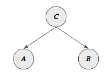
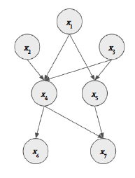

<!-- function for conditional independence -->
\newcommand{\bigCI}{\mathrel{\text{\scalebox{1.07}{$\perp\mkern-10mu\perp$}}}}
\newcommand{\nbigCI}{\cancel{\mathrel{\text{\scalebox{1.07}{$\perp\mkern-10mu\perp$}}}}}

```{r setup, include=FALSE}
knitr::opts_chunk$set(echo = TRUE,
                      warning = FALSE,
                      message = FALSE,
                      comment = NA)
# load libraries
library(qgraph)
library(ppcor) 
library(dplyr)
library(pander)
library(ggplot2)
library(tidyr)
library(huge)
library(RColorBrewer)

# set the seed
set.seed(123)
```

\newpage
\vspace{-0.5cm}

# Recap

## Question 1 (3 points)

1. *FALSE*: since the network models are not equivalent to network theory, one does not necessarily need to assume network theory is true in order to apply network models. One can estimate a network model successfully when the network theory in fact does not hold.

2. *FALSE*: the links between nodes in a network model represent statistical relationships, which cannot be directly translated into causal relationships.

3. *TRUE*: the statement is true.

4. *TRUE*: for an undirected network, the possible number of edges ($m$) can be computed as $n \choose 2$ $= n(n-1)/2$.

5. *TRUE*: the statement is true as PMRFs may be suggestive of causal structure, even though they cannot establish causal relations directly.

6. *FALSE*: using `minimum` argument, we can *hide* the edges under the specified value in the graph but they are not in fact *removed*.

\vspace{-0.5cm}

# Network Appraoches, Theory, and Models

## Question 2 (2 points)

**Write a short scientific essay on the network theory of mental disorders, answering the following questions. What is the external field of a mental disorder and how do you think this would impact it in the common cause framework and in the network framework? What is an implication that follows from the network perspective towards the diagnosis and treatment of mental disorders?.**

\setlength{\parindent}{0.2in}

When it comes to explaining mental disorder and its corresponding symptoms, the common cause framework used to be a dominant view, which states that symptom arises from a single underlying cause. As an alternative, @borsboom_2008 proposed to apply the network framework, which conceptualizes mental disorders as a network of interacting symptoms that reinforce each other.

One of many implications of adopting network approach is that in network framework, we can naturally move our focus beyond the symptom network, considering the environmental factors that are relevant to symptoms [@deboer_2021]. The conditions that encompass these environmental factors that our outside of symptom network, yet having influences on the symptoms, form the *external field* [@borsboom_2008]. For example, adverse life events such as losing a loved one can activate a symptom, which might propagate throughout the network system. It is very plausible and often aligned with the clinical evidences [@borsboom_2013], but under the common cause framework, we cannot incorporate these external factors as part of explanation on developing mental disorders, while the network frame allows us to do so.

Another implication of applying network approach to psychopathology concerns the diagnosis and treatment of mental disorders. Under the traditional common cause framework, the diagnosis tends to follow from the set of symptoms that are defined by DSM-V, after which the diagnosis is used to choose a treatment protocol. In the network framework, however, the mental disorder manifests itself by a cluster of symptoms that are strongly connected to each other and correspondingly, the treatment can follow by identifying and targeting the central symptom nodes that could help breaking the strong connectivity of network system [@borsboom_2013]. Besides, the  network approach accords well with the comorbidity concept, where the relations between symptoms consist of some pathways that connect different disorders (i.e., bridge symptoms). And these so-called bridge symptoms could be promising treatment targets. Lastly, network approach also allows to study individuals’ unique dynamics that may enable us to personalize interventions [@piccirillo_2019].^[***Note.* Reference list can be found at the end of the document.**]


## Question 3 (2 points)

**Choose a paper which makes use of network analysis. Summarize the paper and explain the authors’ choice for performing network analysis (if you don’t agree with the choice, explain why).**

- Chosen paper: *Co-morbid obsessive-compulsive disorder and depression: a Bayesian network approach (2017)* by *R.J, McNally, P.Mair, B.L. Mugno, and B.C. Rieman.*

According to Pinto et al. (2006), about 67.2% of obsessive-compulsive disorder (OCD) patients are diagnosed with major depression. Having observed that many OCD patients become depressed, @mcnally_2017 investigated the comorbidity between OCD and depression using network analysis. The aim of their study was to apply network analysis in order to characterize the functional relationships among symptoms of OCD and depression in the patients who are diagnosed with primary OCD. They collected data on the severity of OCD as well as depression symptoms from 408 OCD patients. To accomplish the study aim, they estimated a network based on a graphical Gaussian model, whereby the edges signify the partial correlations between the pair of nodes while controlling for all the other variables. In addition, they applied a regularization method via running graphical LASSO (glasso). After they obtained their network model, they computed the strength and betweenness centrality to measure the importance of nodes (symptoms). They found that some of the nodes had the greatest strength centrality as well as highest betweenness. Accordingly, they concluded that those symptoms would have high clinical relevance and thus important when it comes to the comorbidity between OCD and depression. 

Overall, I agree with the analytical methods these authors used: fitting graphical LASSO network and computing the centrality/betweenness measures. Fitting a GGM aligns well with the type of data they used (i.e., cross-sectional data with continuous variables) and I do think that using glasso regularization was appropriate given that they had quite many variables (i.e., 26 nodes), which are likely to result in some false-positive edges.  


## Question 4 (2 points)

**Is it worth the hype? Critically reflect on the network approach to psychopathology. Think of one (conceptual or methodological) limitation of the network approach/network analysis in Psychology.**


I believe that the network theory has promoted pioneering psychological research, especially in psychopathology since Borsboom first introduced it in 2008. The claim that the mental disorders emerge from causal interactions among symptoms [@borsboom_2013] has gained a substantial amount of attention over the last two decades as it aligns so well with the intuition on how mental disorder develops. 

A lot of empirical researchers have tried fitting statistical network models to gain insight into these dynamics between symptoms as per the network theory posits [@robinaugh_2020]. Even though the network theory and network model are not equivalent, it is unfortunately often the case that researchers tend to use two terms interchangeably and draw causal inferences based on the estimated network model structure [@ryan2022equilibrium]. One of the limitations of the statistical network model is that the edges in the network only represents the statistical relations, and they cannot be directly translated into causal relations. However, due to the confusion between two concepts, it has been observed that some unjustified causal interpretations were made based on statistical network models [@bringmann_2022]. 

Recently though, there has been active research going on estimating causal network graphs, which actually signify causal relations [@kossakowski_2021]. I expect that with a set of methodologies to discovering causal relations that are currently studied, there will be soon an important extension to the network analysis tool that can validate inferring causal relations. As a conclusion, I think that the network theory is indeed worth the hype. Despite the limitations, it has created a great momentum in psychological research and I believe that there will come additional tools to greatly improve the application of network analysis.


# Causality, Conditional Independece \& PMRFs

## Question 5 (1 point)
**For the indicated graph, explain the dependency structure at hand. What happens if variable $C$ is observed?**

{width=30%}

- $A$ and $B$ are marginally dependent due to the common effect : $A \ \nbigCI \ B$.
- $A$ and $B$ are conditionally independent given C: $A \bigCI B \mid C$.
- If variable $C$ is observed, ... (If C were to be a latent variable and we observed dependency between A and B, then we could have thought that A and B are (marginally) related. However, if we were to observe C and it is not latent any longer, then we can correctly conclude that dependence between A and B is produced by the common cause C, meaning that conditioning on C would screen off the relation between A and B.)


## Question 6 (1 point)
**For the indicated graph below first indicate for each node $x_{k}$ its parent nodes $pa_{k}$. The joint distribution of a graph with $K$ nodes can be expressed by:**

$$
  p(x) = \prod_{k=1}^{K} p(x_{k}\mid pa_{k}) 
$$

**where $pa_{k}$ denotes the set of parents of $x_{k}$. Using this formula, write down the joint distribution $p(x_1,...,x_7)$ for the graph below.**

{width=30%}

Joint distribution for the graph (Figure 2) is as follows:
$$p(x_1,x_2,x_3,x_4,x_5,x_6,x_7) = p(x_1) \cdot p(x_2) \cdot p(x_3) \cdot p(x_4 | x_1, x_2, x_3) \cdot p(x_5 | x_1, x_3) \cdot p(x_6|x_4) \cdot p(x_7|x_4, x_5)$$

## Question 7

```{r, include = FALSE}
# import the data and functions
datafile <- read.table(file='http://borsboomdenny.googlepages.com/datafile.txt')
attach(datafile)
source('http://borsboomdenny.googlepages.com/program.txt')

# check the data
#View(datafile)

# compute the correlation between the variables genes and smoke - 0.1277
cor(genes,smoke)
```

### Question 7.1 (point)
**Consider the three variables \texttt{fingers}, \texttt{cancer} and \texttt{smoke}.**

```{r, results='hide'}
## A
ind(fingers, cancer)         # p < 0.5 they are not independent.
## B
cind(smoke, cancer, fingers) # p < 0.5: they are not conditionally independent.
## C
cind(fingers, cancer, smoke) # p > 0.5: they are conditionally independent given smoke.
## D
cind(smoke, fingers, cancer) # p < 0.5: they are not conditionally independent given cancer.
## E: (additional check) 
ind(fingers, smoke)          # p < 0.5 they are not independent.
ind(cancer, smoke)           # p < 0.5 they are not independent.
```

A) No, `fingers` and `cancer` are *not* independent.
B) No, `smoke` and `cancer` are *not* conditionally independent given `fingers.`
C) Yes, `fingers` and `cancer` are conditionally independent given `smoke`.
D) No, `smoke` and `fingers` are *not* conditionally independent given `cancer`.
E)  `fingers` and `smoke` are *not* independent.  
   `cancer` and `smoke` are *not* independent.  
   _The causal path that is consistent to statistical test results is:_  
   _**`fingers` $\rightarrow$ `smoke` $\rightarrow$ `cancer`** and **`fingers` $\leftarrow$ `smoke` $\rightarrow$ `cancer`**_

```{r, echo=FALSE, fig.height=2, fig.align='center'}
varnames <- c("fingers", "cancer","smoke")
Adj_chain <- matrix(c(0,0,1,
                      0,0,0,
                      0,1,0), 3,3, byrow = TRUE,
              dimnames = list(varnames,varnames))

Adj_fork <- matrix(c(0,0,0,
                     0,0,0,
                     1,1,0), 3,3, byrow = TRUE,
              dimnames = list(varnames,varnames))

laymat <- rbind(c(-1,-1),
                c(1,-1),
                c(0,1))

# change qgraph node, edge and arrow-head size
vsize =15; esize = 10; asize = 10

par(mfrow = c(1,2))
qgraph(Adj_chain, 
       layout = laymat, 
       vsize =vsize, esize = esize, asize = asize, labels = varnames)
qgraph(Adj_fork, 
       layout = laymat, vsize =vsize, esize = esize, asize = asize, labels = varnames)
```


### Question 7.2 (1 point)
**Consider the three variables \texttt{smoke}, \texttt{try} and \texttt{susceptible}.**

```{r, results='hide'}
## A
ind(susceptible, try)         # p > 0.5 they are independent.
## B
cind(susceptible, try, smoke) # p < 0.5: they are not conditionally independent.
## C (additional check) 
ind(susceptible, smoke)       # p < 0.5 they are not independent.
ind(try, smoke)               # p < 0.5 they are not independent.
cind(susceptible, smoke, try) # p < 0.5: they are not conditionally independent.
cind(try, smoke, susceptible) # p < 0.5: they are not conditionally independent.
```

A) Yes, `susceptible` and `try` are independent.
B) No, `susceptible` and `try` are *not* conditionally independent given `smoke`.
C) `susceptible` and `smoke` are *not* independent.  
   `try` and `smoke` are *not* independent.  
   `susceptible` and `smoke` are *not* conditionally independent given `try`.  
   `try` and `smoke` are *not* conditionally independent given `susceptible`.  
  _The causal path that is consistent to statistical test results is: **`susceptible` $\rightarrow$ `smoke` $\leftarrow$ `try`**_


```{r, echo=FALSE,  fig.height = 2, fig.width = 3, fig.align='center'}
varnames <- c("suscep","try","smoke")
Adj_collider <- matrix(c(0,0,1,
                0,0,1,
                0,0,0), 3,3, byrow = TRUE,
              dimnames = list(varnames,varnames))

qgraph(Adj_collider, 
       labels = varnames, 
       layout = rbind(c(-1,-1),
                      c(1,-1),
                      c(0,1)),
       vsize =vsize, esize = esize, asize = asize)
```

### Question 7.3 (1 point)
**Consider the three variables \texttt{try}, \texttt{smoke} and \texttt{cancer}.**
```{r, results='hide'}
## A
ind(try, cancer)               # p < 0.5 they are not independent.
## B
cind(try, cancer, smoke)       # p > 0.5: they are conditionally independent.
## C (additional check) 
ind(try, smoke)                # p < 0.5 they are not independent.
ind(smoke, cancer)             # p < 0.5 they are not independent.
cind(try, smoke, cancer)       # p < 0.5: they are not conditionally independent.
cind(cancer, smoke, try)       # p < 0.5: they are not conditionally independent.
```


A) No, `try` and `cancer` are *not* independent.
B) Yes, `try` and `cancer` are conditionally independent given `smoke`.
C) `try` and `smoke` are *not* independent.  
   `smoke` and `cancer` are *not* independent.  
   `try` and `smoke` are *not* conditionally independent given `cancer`.  
   `cancer` and `smoke` are *not* conditionally independent given `try`.  
   _The causal path that is consistent to statistical test results is:_  
   _**`cancer` $\rightarrow$ `smoke` $\rightarrow$ `try`** and **`cancer` $\leftarrow$ `smoke` $\rightarrow$ `try`**_
   
```{r, echo=FALSE, fig.height=2, fig.align='center'}
varnames <- c("cancer", "try","smoke")

par(mfrow = c(1,2))
qgraph(Adj_chain, 
       layout = laymat, 
       vsize =vsize, esize = esize, asize = asize, labels = varnames)
qgraph(Adj_fork, 
       layout = laymat, vsize =vsize, esize = esize, asize = asize, labels = varnames)
```


### Question 7.4 (1 point)
**Consider the three variables \texttt{genes}, \texttt{susceptible} and \texttt{smoke}.**

```{r, results='hide'}
## A
ind(smoke, genes)                     # p < 0.5 they are not independent.
## B
cind(smoke, susceptible, genes)       # p < 0.5: they are not conditionally independent.
## C 
cind(genes, smoke, susceptible)       # p > 0.5: they are conditionally independent.
## D (additional check)
ind(smoke, susceptible)               # p < 0.5 they are not independent.
ind(genes, susceptible)               # p < 0.5 they are not independent.
cind(genes, susceptible, smoke)       # p < 0.5: they are not conditionally independent.
cind(susceptible, smoke, genes)       # p < 0.5: they are not conditionally independent.
```

A) No, `smoke` and `genes` are *not* independent.
B) No, `smoke` and `susceptible` are *not* conditionally independent given `genes`.
C) Yes, `genes` and `smoke` are conditionally independent given `susceptible`.
D) `smoke` and `susceptible` are *not* independent.  
   `genes` and `susceptible` are *not* independent.  
   `genes` and `susceptible` are *not* conditionally independent given `smoke`.  
   `susceptible` and `smoke` are *not* conditionally independent given `genes`.  
   _The causal path that is consistent to statistical test results is:_  
   _**`genes` $\rightarrow$ `susceptible` $\rightarrow$ `smoke`** and **`genes` $\leftarrow$ `susceptible` $\rightarrow$ `smoke`**_

```{r, echo=FALSE, fig.height=2, fig.align='center'}
varnames <- c("genes", "smoke","suscep")

par(mfrow = c(1,2))
qgraph(Adj_chain, 
       layout = laymat, 
       vsize =vsize, esize = esize, asize = asize, labels = varnames)
qgraph(Adj_fork, 
       layout = laymat, vsize =vsize, esize = esize, asize = asize, labels = varnames)
```

\setlength{\parindent}{0in}

### Question 7.5 (1 point)
**Do any additional checks you want on the full dataset.Then draw your best guess of the DAG that created the data. Indicate the evidence you have for your DAG, as well as the evidence that speaks against it (if you have any). Also indicate for which parts of your DAG you have no conclusive evidence and explain why.**

I will use the (in)dependence relations I find using conditional independence tests, taking a *brute force* approach. Following two principles below, I will first find the skeleton of the DAG based on the results of (in)dependent tests and then, I will orient the edges upon identifying colliders.

- **Principle 1**: Two variables A and B are directly connected in the DAG (either A $\rightarrow$B or B$\rightarrow$A) if and only if they are dependent conditional on every possible subset of the other variables.  
- **Principle 2**: If the skeleton contains a triplet $A−B−C$, the edge can be orientated as A$\rightarrow$B$\leftarrow$C if and only if A and C are dependent conditional on every set of variables containing B.

**Step1**: Perform marginal/conditional independence tests based on correlations using alpha level of 0.05 (assuming normal errors and linear relationships) for every possible pairs and triples.

Below, you can find the table of marginal relations between pairs. The conditional relations between triplets can be found in the *Appendix* at the end of the document (as it is quite lengthy).
```{r, results='hold'}
### Step1: perform conditional independence test
## marginal (in)dependency
# get the variable names
variables <- colnames(datafile)
# all possible combinations of pairs
marginal_string <- t(combn(variables,2))
colnames(marginal_string) <- c("DV1", "DV2")
condition_vars <- list()
for (i in 1:nrow(marginal_string)) {
condition_vars[[i]] <- variables[!variables %in% marginal_string[i,]]
}
## conditional (in)dependency
# condition on 1 variable
cond1_string <- matrix("NA",60,3)
colnames(cond1_string) <- c("DV1", "DV2", "Conditional on")
for(i in 1:4){
  cond1_string[seq(i,60+(i-1), 4), c(1,2)] <- marginal_string[, c(1,2)]
}
# all possible combinations of triples
sequence <- seq(1,60,4)
for (i in 1:nrow(marginal_string)) {
  condition_var <- variables[!variables %in% marginal_string[i,]]
    cond1_string[sequence[i],3] <- condition_var[1]
    cond1_string[sequence[i]+1,3] <- condition_var[2]
    cond1_string[sequence[i]+2,3] <- condition_var[3]
    cond1_string[sequence[i]+3,3] <- condition_var[4]
}

## test the marginal dependencies
marg_p <- apply(marginal_string,1,function(r){
  cor.test(datafile[,r[1]], datafile[,r[2]])$p.value
})

## test the conditional dependencies
c1_p <- apply(cond1_string,1,function(r){
  pcor.test(datafile[,r[1]], datafile[,r[2]], datafile[,r[3]])$p.value
})

# specify alpha level
alpha = 0.05
# results formatted in a table 
marg <- cbind(marginal_string,  Relation = ifelse(marg_p < alpha, "Dependent", "Independent"))
cond <- cbind(cond1_string, Relation = ifelse(c1_p < alpha, "Dependent", "Independent"))
pander(marg, caption = "Marginal relations between pairs")
# pander(cond) # find the table in the Appendix
```


**Step2**: Using the first principle, I will extract the skeleton of the DAG. I will start by drawing an undirected graph where every variable is connected to every other variable. Then, remove edges between variables if they are either marginally or conditionally independent in any of the tests in the previous step.

```{r, results='hide', fig.height=4}
### Step2: extract the skeleton
## find the marginal and conditioanl independencies
marg %>% as.data.frame() %>% filter(Relation == "Independent") 
cond %>% as.data.frame() %>% filter(Relation == "Independent") 

## get the skeleton
# fully connected matrix
adj_full <- matrix(1,6,6)
diag(adj_full) <- 0

adj <- adj_full
# Remove the edges where relation is independent
adj[1,3] <- adj[3,1] <- 0
adj[1,4] <- adj[4,1] <- 0
adj[2,3] <- adj[3,2] <- 0
adj[2,6] <- adj[6,2] <- 0
adj[1,6] <- adj[6,1] <- 0
adj[1,5] <- adj[5,1] <- 0
adj[2,5] <- adj[5,2] <- 0
adj[3,5] <- adj[5,3] <- 0
adj[3,6] <- adj[6,3] <- 0
adj[5,6] <- adj[6,5] <- 0

# plot the skeleton
variables[2] <- "suscep"
par(mfrow=c(1,2))
qgraph(adj_full, labels = variables, vsize = 10, title="Fully Connected Graph")
qgraph(adj, labels = variables, vsize = 10, title="Estimated Skeleton")
```

**Step3**: Using the second principle, I basically perform d-separation rule for colliders and orient the edges. There are five triplets (A - B - C) I need to check if $A \nbigCI B \mid C$ holds:  
A) `cancer` - `smoke` - `fingers`  
B) `fingers` - `smoke` - `susceptible`    
C) `smoke` - `susceptible` - `genes`    
D) `cancer` - `smoke` - `try`  
E) `try` - `smoke` - `susceptible`

As shown in *Table 2* (see Appendix), only `try` - `smoke` - `susceptible` has conditional dependence. Accordingly, we can orient it such that `try` $\rightarrow$ `smoke` $\leftarrow$ `susceptible`.
Upon identifying only one collider in the structure, we can also orient the following edges: `susceptible` $\rightarrow$ `smoke` $\rightarrow$ `fingers` and `cancer` $\leftarrow$ `smoke` $\leftarrow$ `try` because otherwise they also have to be colliders, which cannot be the case based on the found statistical relations. See below for the resulting complete partially directed acyclic graph (CPDAG).
```{r, out.width="50%", fig.align='center'}
### Step3: identify colliders to orient edges
# specify directed (true) and undirected (false) edges
cptf <- matrix(FALSE, 6,6)
cptf[2,4] <- cptf[3,4] <- cptf[4,5] <- cptf[4,6] <- TRUE
# plot the CPDAG
qgraph(adj, labels = variables,  directed = cptf, title = "Estimated CPDAG",  
       asize = 5, vsize = 13, title.cex = 1.5)
```

**Conclusion**: Given the estimated CPDAG, we have two DAGs in the equivalence set (see below), as the relation between `susceptible` - `genes` is inconclusive based on the result of (in)dependence tests. My guess for the true DAG is the one on the left, DAG *(a)*. It makes more sense than DAG *(b)*, as `genes` can sensically affect `susceptibility` but not the other way around. 

```{r DAGs, fig.height = 2.5}
# orient edges
cptf1 <- cptf2 <- cptf
# DAG (a)
cptf1[1,2] <- TRUE
# DAG (b)
cptf2[2,1] <- TRUE
adj2 <- adj
adj2[1,2] <- 0
# plot the DAGs
par(mfrow = c(1,2))
qgraph(adj, labels = variables,  directed = cptf1, title = "(a)",  asize = 5, vsize = 15)
box("figure", col="red", lwd=1) # add outlining box
qgraph(adj2, labels = variables,  directed = cptf2, title = "(b)",  asize = 5, vsize = 15)
```


# Visualizing Networks

## Question 8 (2 points)
**Recreate the following networks as close as possible.**

```{r plotting_network, fig.height=9}
par(mfrow=c(2,1))
## first network
# specify the matrix for the first network
mat1 <- matrix(c(0,0,-1,1,0,
                1,0,0,0,1,
                0,0,0,1,0,
                0,0,0,0,1,
                0,0,1,0,0), 5, 5, byrow=T)
# plot the first network
qgraph(mat1, color = rainbow(5), nodeNames = paste("symptom", 1:5), 
       legend.cex = 0.4, theme = "colorblind", negDashed =T)

## second network
# specify the second matrix
mat2 <- matrix(c(0,1,-1,1,0,
                0,0,0,0,1,
                0,0,0,1,1,
                0,0,0,0,1,
                0,0,0,0,0), 5, 5, byrow=T)

# plot the second network 
qgraph(mat2, directed=FALSE, shape = "square", color = rainbow(5), 
       nodeNames = paste("symptom", 1:5), legend.cex = 0.4)
```


## Question 9 (2 points)
**Visualize the network in R and write a short report (maximum 300 words) describing what the network represents and how it can be interpreted. Most importantly, explain why you visualized it the way you did \textendash \ which is the focus of this assignment, so really think about how important information can best be visualized within a network.** 

- **Data**: I found the data online [(link here)](https://www.cambridge.org/core/journals/psychological-medicine/article/abs/comorbid-obsessivecompulsive-disorder-and-depression-a-bayesian-network-approach/DAA4E2352A9E26809A4EAE35C366E900), which is used in @mcnally_2017 paper. The data contains information on OCD and depression symptoms that are rated on 5-point Likert scale from 0 to 4. There are in total 408 observations and 26 symptom variables (i.e., dimension: 408 by 26). 

- **Analytical Strategy**:
\vspace{-0.4cm}

**Step1**. Presumed that 5-point Likert sacle is sufficient to be treated as interval scales, I decide to use GGM (gaussian graphical model) to estimate the network model of these symptoms.  
**Step2**. Before going about fitting the network, I check the distribution of variables to see if they approximate the normal distribution to some extent. I will transform the data if they deviate much from the normal distribution.  
**Step3**. In order to get a sparse network, I use *glasso* regularization based on EBIC (Extended Bayesian Information Criteria). I tweak the hyperparameter ($\gamma$) to find the optimal sparsity.  
**Step4**. Given the final network model I choose, I explain how I plot the network graph and give some subtantive interpretation on what I can infer from the resulting model. 
```{r prep, results='hide'}
## prepartion
# import data
dat <- read.csv("ocd_dep.csv")   
# check data
glimpse(dat)
```

```{r dist, results='hide', out.width="70%", fig.align='center', fig.cap="Distribution of original variables"}
## check the variable distribution by plotting histograms
dat[,-2] %>% 
  pivot_longer(where(is.numeric)) %>% 
  ggplot(aes(x = value)) +
  geom_histogram(bins = 10) +
  facet_wrap(~name) + 
  theme_minimal()
```

As shown in Figure \@ref(fig:dist), some variables deviate from the normal distribution quite a bit. Following Sascha's advice on non-normal variables, I will transform the data using `huge.npn` function from `huge` package. 

```{r trans, results='hide', out.width="70%", fig.align='center', fig.cap="Distribution of transformed variables"}
## transform data
# some are not normal --> makes the data semiparametric Gaussian using huge package
# following Sacha's advie on non-normal variable
transformed_dat <- huge::huge.npn(dat) %>% as.data.frame()

## check the distributions of transformed data 
transformed_dat[,-2] %>% 
  pivot_longer(where(is.numeric)) %>% 
  ggplot(aes(x = value)) +
  geom_histogram(bins = 10) +
  facet_wrap(~name) + 
  theme_minimal()
```

They approximate the normal distribution better after transformation, as shown in Figure \@ref(fig:trans). 


```{r tunegamma, results='hide',fig.height=6, fig.align='center', fig.cap="Networks with different density"}
## compute the correlations 
cormat <- transformed_dat %>% cor() 

## regularization: find the optimal tuning parameter (gamma) 
layout(matrix(c(1,3,2,4),2,2))
list(0.4, 0.5, 0.6, 0.7) %>% 
  purrr::map(~ EBICglasso(cormat, n = nrow(transformed_dat), gamma = .x) %>% 
               qgraph(layout = "spring", theme= "colorblind", title=paste("gamma", .x)) 
             )
```

As there are quite many variables in the dataset, I decide to apply regularization using *glasso* to get a more sparse network. Given that the general suggestion of gamma ($\gamma$) value is 0.5 [@foygel2010], I vary the gamma value from 0.4 to 0.7 and check the different resulting networks in terms of density.  

Figure \@ref(fig:tunegamma) shows networks with varying gamma values. I find the optimal density when $gamma = 0.6$. Even though the chosen model might have omitted some true edges since I apply quite a conservative gamma value, I prioritize having less false positives (i.e., less spurious edges) in this case. Hence, my final chosen model is the one with $\gamma = 0.6$ (bottom left in Figure \@ref(fig:tunegamma)).


```{r finalnetwork, out.width="130%", fig.align='center', fig.cap="Final model-OCD and depression symptoms"}
## final model: choose gamma = 0.6 for the best sparse network
EBICglasso(cormat, n = nrow(transformed_dat), gamma = 0.6) %>% 
               qgraph(layout = "spring",
                      theme= "colorblind",  
                      groups = list(Depression = 1:16, OCD = 17:26), 
                      color = brewer.pal(2, "Pastel2"), 
                      vsize = 5,
                      nodeNames = colnames(transformed_dat),
                      legend.cex=0.35,
                      cut = 0,
                      legend.mode="style1", 
                      details=TRUE, label.scale=TRUE) 
```

- **Final network model explanation & interpretation**  

As explained above, regularization is applied to this final model using `EBICglasso` function, as I wanted to suppress spurious relations. I used gamma value of 0.6, as it gives the optimal density in my perspective (see Figure \@ref(fig:tunegamma)). As my input is a symmetrical correlation matrix (weight matrix), `qgraph` automatically spits out an undirected network, which is appropriate in this case as I don't know the directionality in relations. I used `layout="spring"` to use the force-embedded layout, which improves the interpretability of the network compared to using the default `circular` layout setting. Then, I used `colorblind` theme for the edges to represent the positive/negative edges in blue and red respectively such that it is colorblind-friendly. I specify the `groups` for the symptoms as per its belonging disorder so that the nodes can be colored correspondingly, which thus helps identifying the possible clusters. As the original symptom names are quite long, I let `qgraph` use the abbreviated names and specify the `nodeNames` so that the full names can be shown in the legend. In addition, I used `cut = 0` to disable the cutoff such that all edges can vary in width and color (saturation) depending on their weights, because this enhances interpretation of the edges. Lastly, I used `maximum = 0.44`, which is the default setting, that is the strongest edge weight in the network. I did not change to 1 (the possibly maximum correlation), as I am mostly interested in the relative strength of relations in this network, not necessarily comparing it to the absolute maximum strength. There are some other minor arguments that I used for aesthetic reasons (e.g., node size, color choice, legend text size).


Figure \@ref(fig:finalnetwork) shows the final network model of OCD and depression symptoms. The network represents the regularized partial correlations (edges) between the symptoms of OCD and depression (nodes). What stands out at a first peek of this network is the clustering of symptoms. The OCD symptoms seem to cluster together so do the depression symptoms. And there is seemingly a sub-cluster in the depression symptoms including `inc`, `wghtg`, `wghtl` and `dcp`^[`inc` = increased appetite; `wghtg` = weight gain; `wghtl` = weight loss; `dcp` = decreased appetite]. Some of the strong edges are observed between `cmpr` & `obr`, `inc` & `wghtg`, and `obd` & `obn`^[`cmpr` = difficulty resisting compulsion; `obr` = difficulty resisting obsessions; `inc` = increased appetite; `wghtg` = weight gain; `obd` = distress caused by obsession; `obn` =  interference due to obsessions] , indicating that they are likely to occur together. Note that given this undirected partial correlation network, the directionality between the symptoms cannot be inferred. In addition, another interesting thing that can be found from this network is the connections between the OCD cluster and depression cluster. There are quite a lot of edges between them and especially the node `obn` (interference due to obsessions) has a lot of connections with the depression symptoms. This may indicate that `obn` is a critical symptom when it comes to the comorbidity between OCD and depression. 


\newpage
# References
<div id="refs"></div>

# Appendix
```{r}
# conditional relations
pander(cond, caption = "Condtional relations of triplets")
```


```{r, fig.width=15}
## correlation plot
# upper <- round(cormat,2)
# upper[upper.tri(cormat)] <- ""
# as.data.frame(upper)

corrplot::corrplot(cormat, method = "number", type = 'lower', diag = FALSE, number.cex=0.5,
                   tl.cex=0.7, tl.col = "black", order="AOE", addCoef.col="black")
```

