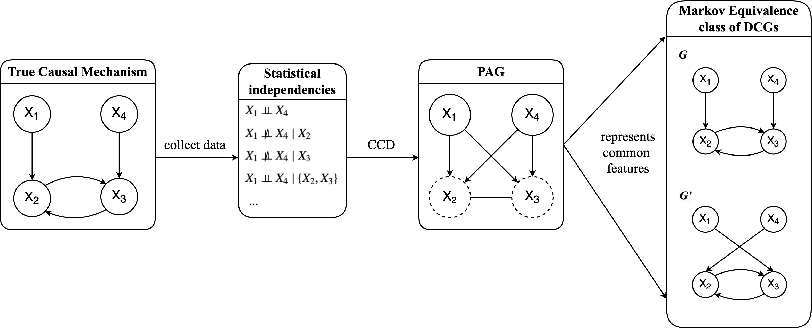

---
output:
  bookdown::pdf_document2:
    number_sections: true
    highlight: tango
    toc: false
bibliography: references.bib
csl: "apa.csl"
link-citations: yes
urlcolor: blue
linkcolor: black
#toccolor: black

mainfont: Calibri
sansfont: Calibri
indent: true
header-includes:
  - \usepackage{indentfirst, graphicx, caption, setspace, floatrow, tikz}
  - \usepackage{setspace}\spacing{1.5}
  - \setlength{\skip\footins}{0.5cm}
  - \captionsetup[table]{skip=5pt}
  - \usepackage[singlelinecheck=false]{caption}
  - \floatsetup[figure]{capposition=top}
  - \floatsetup[table]{capposition=top}
  - \usepackage[labelfont=bf]{caption}
---

```{r setup, include=FALSE}
options(warn = -1) 
knitr::opts_chunk$set(echo = TRUE,
                      warning = FALSE,
                      message = FALSE,
                      comment = NA,
                      fig.align = "center")
library(dplyr)
library(kableExtra)
library(ggplot2)
library(qgraph)
library(pcalg)

source("code/R/CCD_fnc.R")
source("code/R/plot_fnc.R")
source("code/R/dsep_fnc.R")
source("code/R/searchAM_KP_fnc.R")
source("code/R/equivset_fnc.R")
source("code/R/data_generating_fnc.R")
source("code/R/eval_metric_fnc.R")
source("code/R/variation_fnc.R")
```

\pagenumbering{gobble}

\includegraphics[width=0.7cm]{img/logouva.png}
\Large Individual Report

\begin{centering}
\vspace{1cm}
\LARGE
{\bf Critical Reflection on Comparison of Gaussian Graphical Models (GGM) and Directed Cyclic Graph Models (DCG) as Causal Discovery Tools}

\vspace{0.5cm}
\Large
Network Analysis 2022 \\

\vspace{1cm}
\Large
\textbf{Kyuri Park} (12183881) \\

December 22, 2022 \\
\vspace{0.5cm}
\large {Word count: 998}  

\vspace{1cm}

\end{centering}

\pagenumbering{arabic}
\normalsize

\vspace{1cm}
\setcounter{tocdepth}{2}
\renewcommand{\contentsname}{Table of Contents}
\tableofcontents

\newpage
# Summary of Final Project 

In our final project, we aimed to investigate the utility of statistical network models as tools for causal discovery in *cyclic* settings compared to the *directed cyclic graph* models (DCG) by means of a simulation study. 
We used the *cyclic causal discovery* (CCD) algorithm to estimate DCGs [@richardson1996] and compare them to the Gaussian graphical models (GGM). The comparison is made based on the overall density and degree centrality. Note that the output of CCD is a PAG (*partial ancestral graph*)^[See Figure \@ref(fig:pag).], which represents the *Markov-equivalent* class of DCGs (i.e., it encompasses multiple DCGs that are statistically equivalent under the found conditional independencies in the data). Therefore, we computed the *average* density and *average* degree centrality given all the equivalent DCGs per simulated condition and compared those to the density and degree centrality of the GGM and true model, respectively.

The results found that the DCGs approximated the true cyclic models better in terms of both density and degree centrality compared to GGMs. GGMs often overestimated the density and correspondingly resulted in high degrees for almost all nodes in the considered models. The conclusion based on these results could be that statistical network models perform poorly as causal discovery tools in cyclic settings and hence, it shall be preferred to use the purpose-built *causal discovery methods* when one is interested in underlying causal mechanisms.

\vspace{0.5cm}

```{r pag}
#| echo = FALSE,
#| fig.cap= "(ref:pag)",
#| fig.align='center',
#| out.width="101%",
#| dpi=300

```
(ref:pag) Example partial ancestral graph.  

\vspace{-0.3cm}
\setstretch{1.0}
\noindent\small\textit{\textbf{Note.}} Given the found statistical independencies in the data from the true causal mechanism, CCD outputs a partial ancestral graph (PAG). It can be seen that in this example, the PAG represents two different directed cyclic graphs (DCG), of which we compute the density and degree centrality. Then, the average value of density and degree centrality are subsequently used for the comparison with the GGM.

\normalsize
\setstretch{1.5}

# Reflection on Limitations

\noindent However, we cannot just naively draw such conclusion merely based on these results, as there are several limitations in this simulation study. Below, I list two crucial limitations.


1.	We did not explicitly account for the *uncertainty* in estimation with CCD. As explained above, CCD in general cannot uniquely identify one true graph, but instead provides a set of equivalent DCGs (as a form of PAG). The *size* of the equivalent set reflects the level of uncertainty in its estimation, such that the larger the set is, the higher the uncertainty in estimation. Besides the size, the *variation* in the equivalent set can also imply the instability in estimation; the higher the variation, the more unstable the estimates are. It is a critical aspect to further investigate, as it could be the case that even when the average density and degree centrality are closely aligned to those of the true model, the *size* of the set or the *variation* in the set is large, indicating the lack of precision in its estimates.


2.	There is little evidence on practical applicability of CCD, as we only tested it out on rather small simulated models  ($p = 4, 5, 6$) with a very large sample size ($N = 10^6$). The typical psychological data, however, usually consist of much fewer observations while including more variables [@constantin_general_2021]. Thus, whether CCD can be applied to such empirical data and utilized in psychological research in practice is yet questionable.


# Further Extensions

 To examine the overall uncertainty/instability in estimation as to the first limitation, we check the size of equivalent class from each of the simulated models and investigate the variation in the density as well as in degree centrality per each set of DCGs. Regarding the practical applicability of CCD, we test the CCD algorithm on an empirical data [@mcnally2017] and check if it produces a reasonable output. Here, we focus on discussing the analysis results only on the first limitation. For the results on the applicability of CCD, we refer the interested readers to Appendix (section \@ref(appendix)).

## Variation in Density of DCGs
Figure \@ref(fig:density-variation) shows the size of the equivalence class and the distribution of density per set of DCGs from each of the simulated models. First thing that stands out is that the dense models (right column of Figure \@ref(fig:density-variation)) seem to have a slightly higher variation in density (i.e., the spread of distributions is wider), and accordingly the discrepancy between the true and average density of DCGs is larger in the dense models than in the sparse models. This indicates that CCD tends to be less stable when the causal structure is dense and correspondingly, the resulting estimates are more likely to deviate from the true values. 
<!-- when the variation is high in the estimated densities, the average density of DCGs is unlikely to approximate the true density well. Hence, it is not probable that the average density of DCGs follow the true density closely, while having a high variance in the set of densities.  -->

Secondly, it could be seen that the size of equivalence class is overall quite large across all conditions, except for the *sparse model with 4 nodes* case (Figure \@ref(fig:density-variation) (a)). There is no specific pattern observed between the size of equivalence class and the types of simulated models, but these fairly large equivalence classes suggest the lack of certainty in its estimation.

\vspace{0.5cm}

```{r density-variation}
#| echo = FALSE,
#| fig.cap= "(ref:density-variation)",
#| out.width = "77%",
#| fig.align='center',
#| dpi=600
knitr::include_graphics("img/density_variation.pdf")
```
(ref:density-variation) Distribution of density per set of DCGs.  


\vspace{-0.3cm}
\setstretch{1.0}
\noindent\small\textit{\textbf{Note.}} The scale of x-axis is fixed the same across all conditions so that the comparison between distributions can be easily made. In *(a)*, two DCGs in the equivalence class have the same density that is identical to the true density (the two lines overlap). The dense model with 4 nodes in *(b)* seems to be the most difficult case for CCD, given that it has the largest equivalence class (1,659 DCGs) with the highest discrepancy in density among all considered cases. Typically, CCD seems to struggle more to estimate the dense models, seeing that there are more variations and higher deviations from the true values in the dense condition.

\normalsize

\setstretch{1.5}


## Variation in Degree Centrality of DCGs
 Figure \@ref(fig:deg-variation) shows the average degree per node with 95% confidence interval in each of the simulated models. Here, we see that the 95% confidence intervals in the dense models are relatively wider (right column of Figure \@ref(fig:deg-variation)) than the ones in the sparse models (left column of Figure \@ref(fig:deg-variation)), which indicate that there is less stability in degree estimation with the dense models. This is in accordance with the variation in density as shown in Figure \@ref(fig:density-variation), where the dense models are shown to have more variations in the estimated densities. 

\vspace{0.5cm}

```{r deg-variation}
#| echo = FALSE,
#| fig.cap= "(ref:deg-variation)",
#| out.width = "90%",
#| fig.align='center',
#| dpi=600
knitr::include_graphics("img/deg_variation.pdf")
```
(ref:deg-variation) Average degree for every node with 95% confidence interval per set of DCGs. 

\vspace{-0.3cm}
\setstretch{1.0}
\noindent\small\textit{\textbf{Note.}} In *(a)*, the standard error (SE) is zero and accordingly the confidence interval (CI) doesn't exist. For the rest, the values of SE are also very small ($.001 - .01$), which makes it hard to visualize the CIs. For the ease of comparison, the SEs are scaled up. Hence, note that the width of CIs here can only be compared across different cases in a relative sense.
 
\normalsize
\setstretch{1.5}


# Conclusion
 All in all, with these additional analyses, we learn that there typically exists a considerable size of equivalence class and the variation in estimates is relatively large when the causal structure is dense. These findings may imply quite some uncertainty and instability in estimation with CCD, which raises doubts on the estimation precision of causal models. 
 
 However, despite these issues, the core conclusion from our simulation study (i.e., causal models are preferred to statistical network models when causal hypothesis is of interest) remains the same for the following reasons. First, even though the size of equivalence class is generally larger than desired, they are still more informative than the *undirected* statistical network models when it comes to inferring causal relations. Second, the difficulty in estimation with dense structures is equally problematic in statistical network models. In fact, our simulation study showed that causal models still outperformed the statistical network models under the dense conditions, in terms of approximating the true density and degree centrality.
Outside of their use for causal discovery, statistical network models can be very useful as *descriptive* tools; to explore multivariate statistical relationships [@epskamp_gaussian_2018]; to visualize clustering structures [@golino_exploratory_2017]. However, if one is interested in the network approach to search for *causal mechanisms*, then the focus should be on estimating causal models rather than statistical network models.
 
  <!-- However, note that there are other attractive reasons to use statistical network models. For example, Statistical models can not only provide additional information such as the sign and strength of relationships [@epskamp_gaussian_2018], but also visualize clustering structures nicely [@golino_exploratory_2017], which can be very useful. -->

  <!-- we do not state that the statistical network models are completely uninformative in this regard. Statistical models can not only provide additional information such as the sign and strength of relationships [@epskamp_gaussian_2018], but also visualize clustering structures nicely [@golino_exploratory_2017], which can be very useful. These useful characteristics suggest that statistical network models might be best viewed as a descriptive tools rather than tools to discover causal relations in an inductive fashion (Ryan & Haselback). Therefore, if one is interested in the network approach to search for causal mechanism, then the focus should be on estimating causal models rather than statistical network models. -->
 
<!-- But as the variation becomes larger, the average density/degree also deviates more from the true values. Thus, it is unlikely that the average density/degree closely follows the true density/degree in the cases with high variance. However, we still need to keep in mind the rather general limitation that there typically exists a considerable size of equivalence class and correspondingly need to think of what that implies for one's analysis, when using the causal discovery algorithms. -->

<!--  In this project, we aimed to clarify the role of statistical network models (GGM) as causal discovery tools in cyclic settings compared to the directed cyclic graph models (DCG) estimated by CCD algorithm. Overall, the results indicate that GGMs are not suitable for inferring causal structure with cycles. Even though, CCD comes with a couple of limitations as previously discussed, the limitation is not deemed to be detrimental and it is still considered more useful when it comes to modeling a causal structure, as it can approximate the causal relations more accurately.  -->

<!--  Note that it does not state that the statistical network models are completely uninformative in this regard. Statistical models can provide additional information such as the sign and strength of relationships [@epskamp_gaussian_2018] and also visualize clustering structures nicely [@golino_exploratory_2017], which can be useful. However, when it comes to identifying causal relations, the statistical network models come up short, as our simulation study showed. Accordingly, if one is interested in the network approach to search for causal mechanism, then the focus should be on estimating a causal model such as DCGs rather than statistical network models. -->


# References
<div id="refs"></div>

\newpage
# Appendix {#appendix}

Figure \@ref(fig:mcnallypag) shows the partial ancestral graph (PAG) for depression symptoms estimated by CCD algorithm based on the data provided by @mcnally2017. The data consist of 408 observations for 16 depression symptom variables. A couple of features are apparent. First, there are two clusters (islands), one comprising symptoms related to sleeping problems, and the other one comprising symptoms related to appetite issue. Secondly, there exists a cycle (feedback loop): `anhedonia` $\rightarrow$ `fatigue` $\rightarrow$ `retard` $\rightarrow$ `sad` $\rightarrow$ `anhedonia`, which seems reasonable in a substantive sense. Here, we do not know the true underlying causal structure, but the overall findings from this causal model is deemed rather informative and sensible, mostly aligning with our expectations. Given this, it can be concluded that CCD is indeed *applicable in practice* to typical psychological data and can be used to help discovering some interesting causal dynamics in psychological processes.

Just for a comparison, the statistical network model (GGM) is also estimated using graphical LASSO [@epskamp_tutorial_2018] as shown in Figure \@ref(fig:mcnallynetwork). In accordance with the causal model, similar clustering structures are observed with symptoms related to sleep and appetite. Even though here with the statistical network model, we could additionally examine the sign (positive/negative) and the strength of relations between symptoms, we can hardly infer any causal relations or detect the presence of feedback loops, as we did with the causal model.

\vspace{0.5cm}

\newcommand{\udensdot}[1]{
    \tikz[baseline=(todotted.base)]{
        \node[inner sep=1pt,outer sep=0pt] (todotted) {#1};
        \draw[densely dotted] (todotted.south west) -- (todotted.south east);
    }
}


```{r mcnallypag}
#| echo = FALSE,
#| results = 'hide',
#| fig.height = 3.5,
#| fig.width = 4.5,
#| fig.cap = "PAG estimated by CCD algorithm for depression symptoms."
## empirical data example
# import data
mcnally <- read.csv("data/McNally.csv")
# separate dep / ocd symptoms
depression <- mcnally[,1:16]
ocd <- mcnally[,17:26]

# estimat PAG on depression symptoms (run CCD)
ccd_mcnally_dep <- ccdKP(df=depression, dataType = "discrete", depth = -1)
mat_mcnally_dep <- CreateAdjMat(ccd_mcnally_dep, p = ncol(depression))
pag_mcnally_dep <- plotPAG(ccd_mcnally_dep, mat_mcnally_dep)
```

\vspace{-0.1cm}
\setstretch{1.0}
\noindent\small\textit{\textbf{Note.}} In the PAG representation, there exists two types of underlining that are used in a triple of nodes: solid underlining ($\text{A - {\underline{B} - C}}$) and dotted underlining ($\text{A - {\udensdot{B} - C}}$). The colored nodes (in blue) refer to the presence of the solid underlinings and the dashed nodes refer to the presence of dotted underlinings on the corresponding nodes. These underlinings are used to further orient the edges in a PAG. For more information, see @Richardson1996a.
 
\normalsize
\setstretch{1.5}

```{r mcnallynetwork}
#| echo = FALSE,
#| results = 'hide',
#| fig.height = 5,
#| fig.width = 6,
#| fig.cap = "Statistical network model constructed via graphical LASSO for depression symptoms."

# estimate network model for depression symptoms (graphical LASSO)
cordep <- cor(depression)
glassoFitdep <- EBICglasso(cordep, n = nrow(depression), gamma = 1)
qgraph(glassoFitdep, layout = "spring", theme="colorblind", nodeNames = colnames(depression), legend.cex = 0.4)
```
