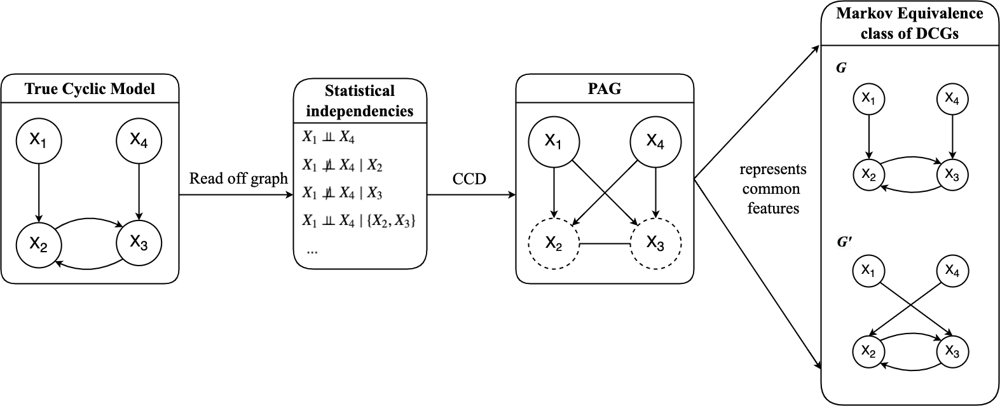

---
output:
  bookdown::pdf_document2:
    number_sections: true
    highlight: tango
    toc: false
bibliography: references.bib
csl: "apa.csl"
link-citations: yes
#urlcolor: blue
#linkcolor: blue

#geometry: margin = 2cm
#fontsize: 11.5pt
mainfont: Calibri
sansfont: Calibri
indent: true
header-includes:
  - \usepackage{indentfirst, graphicx, caption, setspace, floatrow, tikz}
  - \usepackage{setspace}\spacing{1.5}
  - \setlength{\skip\footins}{0.5cm}
  - \captionsetup[table]{skip=5pt}
  - \usepackage[singlelinecheck=false]{caption}
  - \floatsetup[figure]{capposition=top}
  - \floatsetup[table]{capposition=top}
  - \usepackage[labelfont=bf]{caption}
  #- \usepackage[normalem]{ulem}

---

```{r setup, include=FALSE}
options(warn = -1) 
knitr::opts_chunk$set(echo = TRUE,
                      warning = FALSE,
                      message = FALSE,
                      comment = NA,
                      fig.align = "center")
library(dplyr)
library(kableExtra)
library(ggplot2)
library(qgraph)
library(pcalg)

source("code/R/CCD_fnc.R")
source("code/R/plot_fnc.R")
source("code/R/dsep_fnc.R")
source("code/R/searchAM_KP_fnc.R")
source("code/R/equivset_fnc.R")
source("code/R/data_generating_fnc.R")
source("code/R/eval_metric_fnc.R")
source("code/R/variation_fnc.R")
```

\pagenumbering{gobble}

\includegraphics[width=0.7cm]{img/logouva.png}
\Large Individual Report

\begin{centering}
\vspace{1cm}
\LARGE
{\bf Critical Reflection on Comparison of GGM and Directed Cyclic Graph Model}

\vspace{0.5cm}
\Large
Network Analysis 2022 \\

\vspace{1cm}
\Large
\textbf{Kyuri Park} (12183881) \\

December 22, 2022 \\
\vspace{0.5cm}
\large {Word count: 994}  

\vspace{1cm}

\end{centering}

\pagenumbering{arabic}
\normalsize

\vspace{1cm}
\setcounter{tocdepth}{2}
\renewcommand{\contentsname}{Table of Contents}
\tableofcontents

\newpage
# Summary of Final Project 

In our final project, we aimed to investigate the utility of statistical network models as a tool for causal discovery in *cyclic* settings compared to the *directed cyclic graph* models (DCG) by means of a simulation study. 
We used *cyclic causal discovery* (CCD) algorithm to estimate DCGs [@richardson1996] and compare it to the Gaussian graphical model (GGM). The comparison is made based on the overall density of the model and degree centrality of each node. Note that the output of CCD is a PAG (*partial ancestral graph*)^[See Figure \@ref(fig:pag).], which represents the *Markov-equivalent* class of DCGs (i.e., it encompasses multiple DCGs that are statistically equivalent under the found conditional independencies in the data). Therefore, we computed the average density and average degree centrality per node for all equivalent DCGs and compared those to the density and degree centrality of GGM and true model, respectively.

The results found that the DCGs approximated the true cyclic models better in terms of both density and degree centrality compared to GGMs. GGM often overestimated the density and correspondingly resulted in high degree for almost all nodes in the considered models. The conclusion based on these results could be that statistical network model performs poorly as causal discovery tools in cyclic settings and hence, it shall be preferred to use a purpose-built *causal discovery methods* when one is interested in underlying causal mechanism.

\vspace{0.5cm}

```{r pag}
#| echo = FALSE,
#| fig.cap= "(ref:pag)",
#| fig.align='center',
#| out.width="101%",
#| dpi=300

```
(ref:pag) Example partial ancestral graph.  

\vspace{-0.3cm}
\setstretch{1.0}
\noindent\small\textit{\textbf{Note.}} Given the found statistical independencies from the true graph, CCD outputs a partial ancestral graph (PAG). It can be seen that in this example, the PAG represents two different directed cyclic graphs (DCG), of which we compute the density and degree centrality. Then, the average value of density and degree centrality are subsequently used for comparison with the GGM.

\normalsize
\setstretch{1.5}

# Reflection on Findings

\noindent However, we cannot just naively draw such conclusion merely based on these results, as there are several limitations in this simulation study. Below, I list two crucial limitations in my opinion.

1.	We did not explicitly account for the *uncertainty* in estimation with CCD. As explained above, CCD in general cannot uniquely identify one true graph, but instead provides a set of equivalent DCGs (as a form of PAG). The size of the equivalent class thus reflects the uncertainty in its estimation. But this was not investigated thoroughly in our simulation study. I believe that it is a critical aspect to further investigate, as it could be the case that even when the average density and average degree centrality are closely aligned to those of the true model, the *variation* in the set is huge, which implies a high uncertainty/instability in estimation. 

2.	The actual applicability of CCD is unclear, as we only tested out on rather small models ($p = 4, 5, 6$) with a very large sample size ($N = 10^6$). The typical psychological data usually contain much less observations while including more variables [@constantin_general_2021]. Thus, whether CCD can be applied to such data and utilized in psychological research in practice is yet questionable.

# Further Extension

\noindent To examine the overall uncertainty and variation in estimation concerning the first limitation, I will check the size of equivalent class from each of the considered models and investigate the variation in the density as well as degree centrality per each set of DCGs. Regarding the practical applicability of CCD, I will test the CCD algorithm on an empirical data [@mcnally2017] and check if it produces a reasonable output. Here, I will focus on discussing the analysis result only on the first limitation. For the results on the applicability of CCD in practice, I refer the interested readers to Appendix (section \@ref(appendix)).

## Variation in Density of DCGs
\noindent Figure \@ref(fig:density-variation) shows the size of equivalence class and distribution of density per set of the DCGs from each of considered models. First thing that stands out is that in general high-density models seem to have a slightly higher variation in density (i.e., spread of distribution is wider)^[The scale of x-axis is fixed the same across the graphs.] and accordingly the discrepancy between true density and average density of DCGs is larger compared to the low-density models. This indicates that when variation is high, the average density of DCGs is unlikely to align well with the true density. Secondly, it could be seen that the size of equivalence class is overall quite large, except for the *4 nodes model with low density* case. There is no specific pattern observed between the size of equivalence class and types of models, but these overall fairly large equivalence classes suggest the lack of precision in estimation with CCD, which could be seen as a weakness of causal discovery algorithm.


```{r density-variation}
#| echo = FALSE,
#| fig.cap= "(ref:density-variation)",
#| out.width = "80%",
#| fig.align='center',
#| dpi=600
knitr::include_graphics("img/density_variation.pdf")
```
(ref:density-variation) Distribution of density per the set of DCGs. 


## Variation in Degree Centrality of DCGs
\noindent Figure \@ref(fig:deg-variation) shows the average degree per node with 95% confidence interval in each of the considered models. Here, we see that the 95% confidence intervals in the high-density models are relatively wider than the ones in the low-density models, which indicate that there are more uncertainty in degree estimation with high-density models. This is in accordance with the variation in density as shown in Figure \@ref(fig:density-variation), where the high-density models are shown to have more variation in the overall density estimation. All in all, with these additional analyses, we learn that the variation in estimation with CCD tends to become higher when the models are dense, and in general, the size of equivalence class of DCGs is fairly large ($>100$), which needs to be accounted for, when using the causal discovery algorithms. 

\vspace{0.5cm}

```{r deg-variation}
#| echo = FALSE,
#| fig.cap= "(ref:deg-variation)",
#| out.width = "90%",
#| fig.align='center',
#| dpi=600
knitr::include_graphics("img/deg_variation.pdf")
```
(ref:deg-variation) Average degree per node with 95% confidence interval. 

\vspace{-0.3cm}
\setstretch{1.0}
\noindent\small\textit{\textbf{Note.}} In (a), the standard error (SE) is zero and accordingly confidence interval (CI) doesn't exist. For the rest, the value of SE is also very small (0.01 - 0.01), which makes it hard to visualize CIs. For the ease of comparison, the SE is scaled up. Hence, note that the width of CIs can only be compared in a relative sense.
 
\normalsize
\setstretch{1.5}


\newpage
# Conclusion
\noindent In this project, we aimed to clarify the role of statistical network models (GGM) as causal discovery tools compared to the causal discovery method (CCD) in cyclic settings. Overall, the results indicate that GGM is not suitable for inferring causal structure with cycles. Even though, CCD comes with a couple of limitations as previously discussed (e.g., not able to uniquely identify one true graph), the limitation is deemed not detrimental and it is still considered to be more useful when it comes to generating causal hypotheses based on observational data. Note that it does not state that the statistical network models are completely uninformative. Outside of their use for causal discovery, there are other attractive reasons to use statistical network models. For instance, they are very useful as descriptive tools to summarize the multivariate statistical relationships [@epskamp_gaussian_2018] and to visualize the clustering structure [@golino_exploratory_2017]. However, when it comes to identifying causal relations, these statistical network models come up short as our simulation study showed. Accordingly, when one is interested in the network approach to search for causal mechanism, then the focus should be on estimating a causal model rather than statistical network models.


# References
<div id="refs"></div>

\newpage
# Appendix {#appendix}

Figure \@ref(fig:mcnallypag) shows the partial ancestral graph (PAG) for depression symptoms estimated by CCD algorithm based on the data provided by @mcnally2017. A couple of features are apparent. First, there are two clusters (islands), one comprising symptoms related to sleeping problems, and the other comprising symptoms related to appetite issue. Secondly, there exists a cycle (feedback loop): `anhedonia` $\rightarrow$ `fatigue` $\rightarrow$ `retard` $\rightarrow$ `sad` $\rightarrow$ `anhedonia`, which is interesting and seems reasonable. Here, we do not know the true model but the overall findings from this causal model is considered rather informative and sensible. Therefore, it is concluded that CCD can be actually applied in practice to typical psychological data and be used to help discovering some interesting causal dynamics between variables.

For the comparison, the statistical network model (GGM) is also estimated using graphical LASSO [@epskamp_tutorial_2018] as shown in Figure \@ref(fig:mcnallynetwork). In accordance with the causal model, similar clustering is again observed between symptoms related to sleep and appetite. Even though here with the statistical network model, we could additionally examine the sign of relations (positive/negative) and the strength of relations between symptoms, we cannot directly infer any causal relations, as expected.

\vspace{0.5cm}

\newcommand{\udensdot}[1]{
    \tikz[baseline=(todotted.base)]{
        \node[inner sep=1pt,outer sep=0pt] (todotted) {#1};
        \draw[densely dotted] (todotted.south west) -- (todotted.south east);
    }
}

```{r mcnallypag}
#| echo = FALSE,
#| results = 'hide',
#| fig.height = 4,
#| fig.width = 5,
#| fig.cap = "PAG estimated by CCD algorithm for depression symptoms."
## empirical data example
# import data
mcnally <- read.csv("data/McNally.csv")
# separate dep / ocd symptoms
depression <- mcnally[,1:16]
ocd <- mcnally[,17:26]

# estimat PAG on depression symptoms (run CCD)
ccd_mcnally_dep <- ccdKP(df=depression, dataType = "discrete", depth = -1)
mat_mcnally_dep <- CreateAdjMat(ccd_mcnally_dep, p = ncol(depression))
pag_mcnally_dep <- plotPAG(ccd_mcnally_dep, mat_mcnally_dep)
```

\vspace{-0.1cm}
\setstretch{1.0}
\noindent\small\textit{\textbf{Note.}} In the PAG representation, there exists two types of underlining that can be used in a triple of nodes: solid underline ($\text{A - {\underline{B} - C}}$) and dotted underline ($\text{A - {\udensdot{B} - C}}$). The colored nodes (in blue) refer to the presence of the solid underlining and the dashed nodes refer to the presence of the dotted underlining on the corresponding nodes. These underlines are used to further orient the edges in a PAG. For more information on this, see @Richardson1996a.
 
\normalsize
\setstretch{1.5}

```{r mcnallynetwork}
#| echo = FALSE,
#| results = 'hide',
#| fig.height = 4,
#| fig.width = 5,
#| fig.cap = "Statistical network model constructed via graphical LASSO for depression symptoms."

# estimate network model for depression symptoms (graphical LASSO)
cordep <- cor(depression)
glassoFitdep <- EBICglasso(cordep, n = nrow(depression), gamma = 1)
qgraph(glassoFitdep, layout = "spring", theme="colorblind", nodeNames = colnames(depression), legend.cex = 0.4)
```
